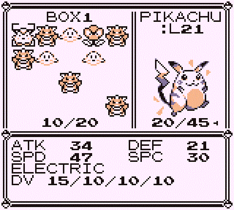
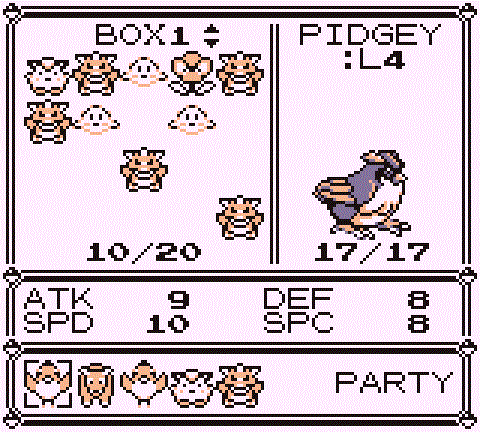

**A storage-system overhaul for the [Pokémon Gen 1 Recompilation Project](https://github.com/bryanthaboi/pokemon-gen1-recomp-project).**

Free box paging that never writes your save · grab-and-place rearranging · an inline art and stats panel

  
  
  

---

Bill's PC+ replaces the built-in PC box screen with a grid interface. Browse and
rearrange your boxes freely — the PC never writes your save at all, so nothing
interrupts you and nothing is decided for you.

   
  Box view — free paging, grab-and-place with gaps

   
  Deposit view — party row and destination paging

## Features

- **Free box paging** — walk the cursor off the left or right edge of the grid
  to page between boxes. No prompt, no save, no interruption.
- **Grab-and-place, with gaps** — pick a Pokemon up with `A`, drop it on any
  cell. Swap if the slot is occupied, place if it is free, and the rest stay
  exactly where they were. Cross-box moves just work.
- **Inline art and stats panel** — the selected Pokemon's front sprite and
  condensed stats (level, HP, ATK/DEF/SPD/SPC) sit beside the grid, and keep
  describing the Pokemon in hand while you carry it.
- **Deposit mode** — your party appears as a row under the box; pick one and
  page the destination box independently.
- **The PC never writes your save** — not when you page, not when you move a
  Pokemon, not on the way out. Whatever you did rides along with your next
  ordinary save, so saving stays where you chose to put it: the START menu.
  Nothing else writes it either: while the PC is open, a save attempted from
  anywhere else is refused, the way vanilla simply had no way to save in
  there. It is not thrown away, though. If an autosave mod tried to save
  while you were in the PC, that save happens the moment you leave. The
  flip side is real — quit without saving and the PC visit goes
  with everything else you did since.
- **Readable cursor** — blinking corner marks on the selected cell, holding
  steady over a carry's landing spot, readable on empty slots.
- **Stays Gen 1** — everything is drawn from the game itself: the same font,
  window borders, palette and sound effects as the vanilla PC, so the grid
  reads like something the Game Boy could have shipped.

## Install

**Mod manager:** grab the release zip from
[Releases](../../releases) and import it — FIND MODS in the launcher, or drop
the zip into the save directory's `imports/mods/` folder and rescan.

**Manual:** unzip the release into the game's `mods/bills_pc_plus/` directory.
It claims the `BoxMenu` screen id, so it replaces the built-in PC box screen
with no further configuration.

## Controls

Opening the PC shows a menu:

| Row | Action |
|---|---|
| WITHDRAW POKéMON | Opens the box grid |
| DEPOSIT POKéMON | Opens the box grid with your party shown as a row |
| SEE YA! | Leaves the PC |

`B` from either grid returns to this menu, so switching between withdrawing
and depositing is `B` then pick.

### Box view (WITHDRAW)

| Input | Action |
|---|---|
| D-pad | Move the cursor within the grid |
| Left/Right at a grid edge | Page to the previous/next box, cursor wrapping to the opposite column |
| A on a Pokemon | Cursor menu: MOVE / WITHDRAW / STATS / RELEASE / CANCEL |
| A while carrying | Drop: swap if the slot is occupied, append if empty |
| B | Cancel carry; if not carrying, back to the menu |

### Deposit view (DEPOSIT)

| Input | Action |
|---|---|
| Left/Right | Move along the party row (what to deposit) |
| Up/Down | Page the destination box (where to put it) |
| A | Deposit the highlighted Pokemon into the box shown |
| B | Back to the menu |

## Known limitations

- **Gaps are a display layer, not cartridge data.** The Gen 1 save format
  stores a count byte followed by that many contiguous Pokemon — no hole
  encoding — so the layout rides in the engine save beside it. Exporting a
  .sav packs each box in reading order; importing one refills that box
  solid. A mon caught since your last visit fills the leftmost gap and
  moves nobody. Trading does not disturb the boxes at all: a trade swaps
  a party slot, so the layout is untouched.
- **A box something else rearranged loses its gaps, rather than muddling
  them.** The layout says "packed mon k sits at the kth remembered cell",
  which only means anything for the mon list it was recorded against.
  Anything that removes a Pokemon from the middle of a box from outside
  the PC (disabling a mod that added species is the one way to do it
  today) shifts every later mon down an index. The mod stores a digest
  of the mons each layout described and packs that box solid when it no
  longer matches, so the gaps go rather than landing on the wrong
  Pokemon. No Pokemon is moved or lost either way.
- **The PC no longer writes, so it no longer protects you.** Vanilla wrote
  SRAM on every box change, which meant a deposit could not be lost. Here a
  deposit lives in memory like the rest of your progress until you save from
  the START menu. While the grid is open the boxes are mid-flight, and a
  Pokemon you have picked up is in no box and in no party at all, so the
  mod claims the engine's `save.write` hook and refuses any save attempted
  from inside the PC (the F1 hotkey, an autosave mod). The refusal lands
  before a single byte is captured. Refusing is not the same as swallowing:
  a mod that autosaved in there believes it saved, so leaving the PC
  reconciles the boxes and then replays the save that was asked for. A
  visit nothing tried to save through still writes nothing at all.
- `save.currentBox` follows the box you were last looking at, and persists
  with your next save whether or not you moved anything.
- If every cell of every box is full, cancelling a carry refuses with a
  message and the Pokemon stays in hand, rather than creating an
  over-capacity box.

## Version

Newest release: [releases/latest](https://github.com/Code-Grub/bills-pc-plus/releases/latest) — full history in [CHANGELOG.md](CHANGELOG.md).

## License

MIT — see [LICENSE](LICENSE). Fork it, bundle it, build on it; just keep the
notice. The mod draws its font, borders, palette and sounds from the game at
runtime and ships no game assets of its own.
