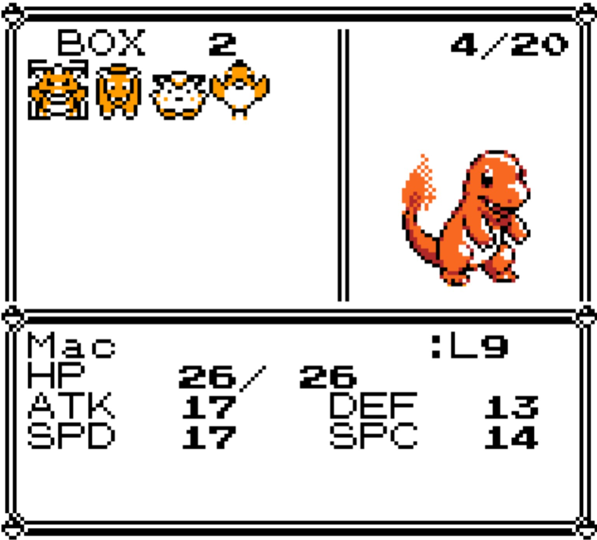
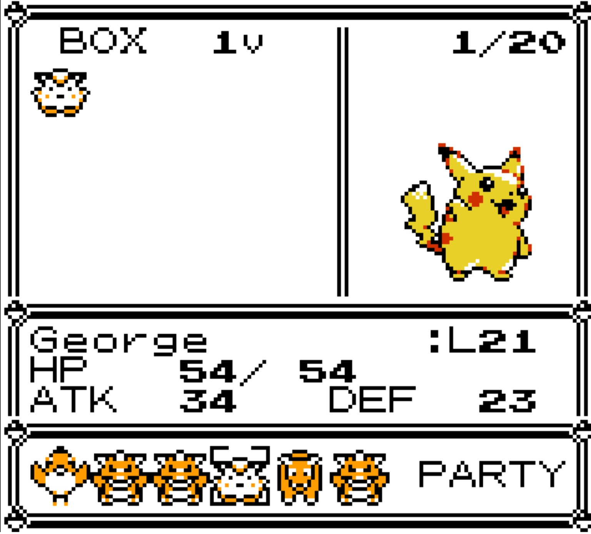

**A storage-system overhaul for the [Pokémon Gen 1 Recompilation Project](https://github.com/bryanthaboi/pokemon-gen1-recomp-project).**

Free box paging with no forced save · grab-and-place rearranging · an inline art and stats panel

---

Bill's PC+ replaces the built-in PC box screen with a grid interface. Browse and
rearrange your boxes freely — the game is only written when you actually move
something, and it tells you when it does.

   
  Box view

   
  Deposit view

## Features

- **Free box paging** — walk the cursor off the left or right edge of the grid
  to page between boxes. No forced save when you switch; `save.currentBox` only
  persists if you move something.
- **Grab-and-place** — pick a Pokemon up with `A`, drop it on any slot. Swap if
  the slot is occupied, append if empty. Cross-box moves just work.
- **Inline art and stats panel** — the selected Pokemon's front sprite and
  condensed stats (level, HP, ATK/DEF/SPD/SPC) sit beside the grid, and keep
  describing the Pokemon in hand while you carry it.
- **Deposit mode** — your party appears as a row under the box; pick one and
  page the destination box independently.
- **Honest saves** — the PC menu is the only place the game writes your save,
  and it announces it with the same "Now saving... / saved the game!" pages as
  the START menu's SAVE. Browsing writes nothing and shows nothing.
- **Readable cursor** — blinking corner marks on the selected cell, holding
  steady over a carry's landing spot, readable on empty slots.

## Install

**Mod manager:** grab the release zip from
[Releases](../../releases) and import it — FIND MODS in the launcher, or drop
the zip into the save directory's `imports/mods/` folder and rescan.

**Manual:** unzip the release into the game's `mods/bills_pc_plus/` directory.
It claims the `BoxMenu` screen id, so it replaces the built-in PC box screen
with no further configuration.

## Controls

Opening the PC shows a menu:

| Row | Action |
|---|---|
| WITHDRAW POKéMON | Opens the box grid |
| DEPOSIT POKéMON | Opens the box grid with your party shown as a row |
| SEE YA! | Leaves the PC, saving if anything moved |

`B` from either grid returns to this menu, so switching between withdrawing
and depositing is `B` then pick.

### Box view (WITHDRAW)

| Input | Action |
|---|---|
| D-pad | Move the cursor within the grid |
| Left/Right at a grid edge | Page to the previous/next box, cursor wrapping to the opposite column |
| A on a Pokemon | Cursor menu: MOVE / WITHDRAW / STATS / RELEASE / CANCEL |
| A while carrying | Drop: swap if the slot is occupied, append if empty |
| B | Cancel carry; if not carrying, back to the menu |

### Deposit view (DEPOSIT)

| Input | Action |
|---|---|
| Left/Right | Move along the party row (what to deposit) |
| Up/Down | Page the destination box (where to put it) |
| A | Deposit the highlighted Pokemon into the box shown |
| B | Back to the menu |

## Known limitations

- **Boxes stay packed.** Occupied slots always run 1..n with no gaps — the
  cartridge save format stores a count byte followed by that many contiguous
  Pokemon, so a decorative gap has no encoding and would be destroyed on
  export. Rearranging, swapping and cross-box moves all work; only scattered
  placement is unavailable.
- `save.currentBox` does not persist if the player only browsed. Changing box
  never marks the save dirty, since that is the point of the feature.
- If every box is full, cancelling a carry refuses with a message and the
  Pokemon stays in hand, rather than creating an over-capacity box.

## Version

Current release: **0.8.0** — see [CHANGELOG.md](CHANGELOG.md).
