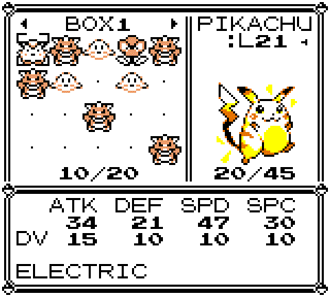
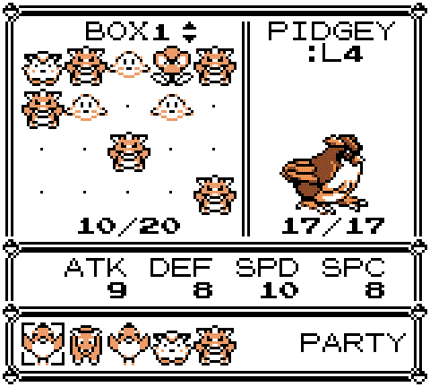

**A storage-system overhaul for the [Pokémon Gen 1 Recompilation Project](https://github.com/bryanthaboi/pokemon-gen1-recomp-project).**

Free box paging that never writes your save · grab-and-place rearranging · an inline art and stats panel

  
  
  

---

Bill's PC+ replaces the built-in PC box screen with a grid interface. Browse and
rearrange your boxes freely. It works on Red, Blue and Yellow, and on Gold,
Silver and Crystal.

   
  Box view: free paging, grab-and-place with gaps

   
  Deposit view: party row and destination paging

## Features

- **Free box paging:** move the cursor off the left or right edge of the grid
  to change boxes. No prompt, no save.
- **Grab-and-place, with gaps:** pick a Pokemon up with `A` and drop it on any
  slot. Other Pokemon stay where they are, and moves between boxes just work.
- **Art and stats panel:** the selected Pokemon's sprite and stats sit beside
  the grid.
- **DV display:** the hidden DV numbers on the stats strip. On by default;
  turn it off in OPTIONS → MODS → BILL'S PC PLUS → DV DISPLAY.
- **Extra boxes:** OPTIONS → MODS → BILL'S PC PLUS → EXTRA BOXES gives you 99
  boxes instead of 12 (Red, Blue, Yellow) or 14 (Gold, Silver, Crystal), each
  holding 20. Off by default. Turning it off never deletes anything: Pokemon
  in the extra boxes come back when you turn it on again.
- **Deposit mode:** your party appears as a row under the box, so you can pick
  who to deposit and page to the box you want.
- **No saving inside the PC:** the PC never writes your save. Everything you
  do there is kept with your next normal save from the START menu.
- **Stays Gen 1.** Everything is drawn from the game itself: the same font,
  window borders, palette and sound effects as the vanilla PC, so the grid
  reads like something the Game Boy could have shipped.

## Install

**Mod manager:** grab the release zip from
[Releases](../../releases) and import it with FIND MODS in the launcher, or drop
the zip into the save directory's `imports/mods/` folder and rescan.

**Manual:** unzip the release into the game's `mods/bills_pc_plus/` directory.

## Controls

Opening the PC shows a menu:

| Row | Action |
|---|---|
| WITHDRAW POKéMON | Opens the box grid |
| DEPOSIT POKéMON | Opens the box grid with your party shown as a row |
| SEE YA! | Leaves the PC |

`B` from either grid returns to this menu. On Gold, Silver and Crystal the
game's own PC menu asks WITHDRAW, DEPOSIT or MOVE first and opens the grid in
that view.

### Box view (WITHDRAW)

| Input | Action |
|---|---|
| D-pad | Move the cursor within the grid |
| Left/Right at a grid edge | Page to the previous/next box |
| A on a Pokemon | Cursor menu: MOVE / WITHDRAW / STATS / RELEASE / CANCEL |
| A while carrying | Drop: swap if the slot is occupied, place it in that slot if empty |
| B | Cancel carry; if not carrying, back to the menu |

### Deposit view (DEPOSIT)

| Input | Action |
|---|---|
| Left/Right | Move along the party row (what to deposit) |
| Up/Down | Page the destination box (where to put it) |
| A | Deposit the highlighted Pokemon into the box shown |
| B | Back to the menu |

## Known limitations

- **Save from the START menu.** The PC does not save, so quitting without
  saving loses what you did in the PC along with everything else.
- **Gaps are not part of a cartridge save.** Exporting a .sav packs each box
  in order, and importing one fills boxes without gaps.
- **Extra boxes are not part of a cartridge save.** Exporting a .sav includes
  only the original 12 or 14 boxes.
- **Gen 2:** the DV row has no label, and an egg's portrait shows the Pokemon
  it will hatch into.

## Version

Newest release: [releases/latest](https://github.com/Code-Grub/bills-pc-plus/releases/latest). Full history in [CHANGELOG.md](CHANGELOG.md).

## License

MIT. See [LICENSE](LICENSE). Fork it, bundle it, build on it; just keep the
notice. The mod draws its font, borders, palette and sounds from the game at
runtime and ships no game assets of its own.
